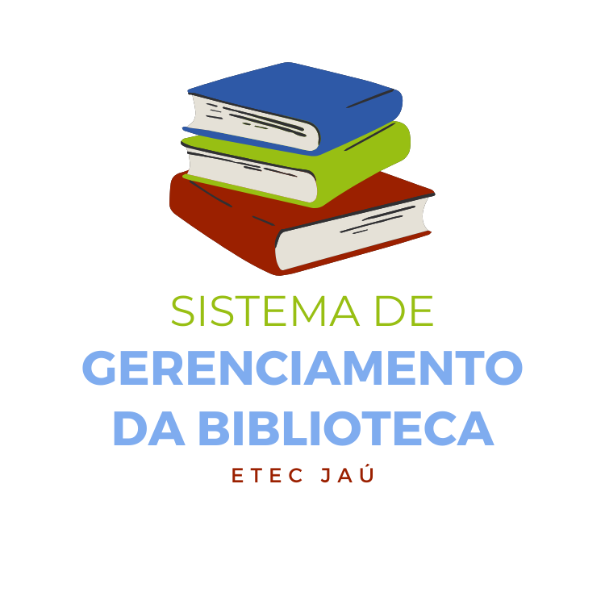
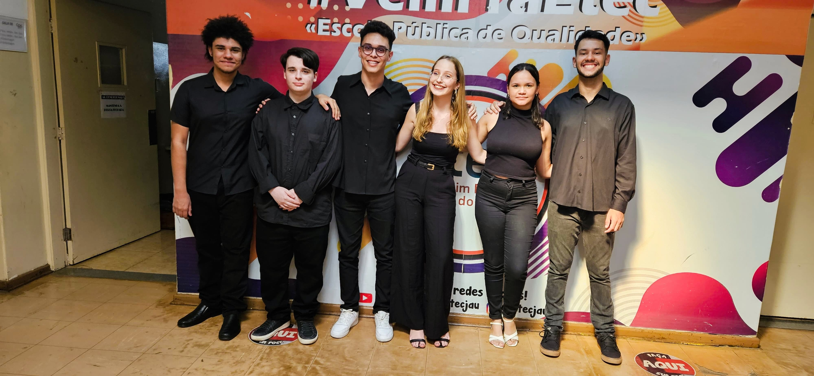

  

## Trabalho de Conclusão de Curso 
Sistema de Pesquisa, Empréstimo e Devolução de Livros para Bibliotecas.

Integrantes: [Alisson Moreno](https://github.com/AlissonMMC), [Ana Clara Pinto](https://github.com/anacll-dev), [Arthur Santana](https://github.com/arthursantana-dev), [Eduarda Koehler](https://github.com/DudaKoehler-dev), [Iago Fragnan](https://github.com/iagof-dev) e [Matheus H. Ferreira](https://github.com/MathFerreiraDev). 

  

## API & Documentação

[Link da API](https://marciossupiais.shop/tcc/)

[Documentação](https://n3rdy.gitbook.io/sistema-gerenciamento-da-biblioteca-api-tcc/)

[Repositório](https://github.com/iagof-dev/TCC-api)

## Demonstração

https://github.com/user-attachments/assets/9a165487-a623-4e84-80e0-a5741fcc5546

